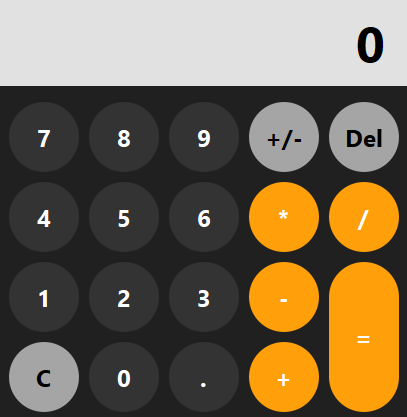

<h3>Calculator</h3>

Calculator application written in C++ with interface made using Qt widgets.

After calculating a number, said number is saved so you can continue doing operations with it.

You can perform the following operations:

<ul>
  <li>Addition</li>
  <li>Subtraction</li>
  <li>Multiplication</li>
  <li>Division</li>
</ul>
